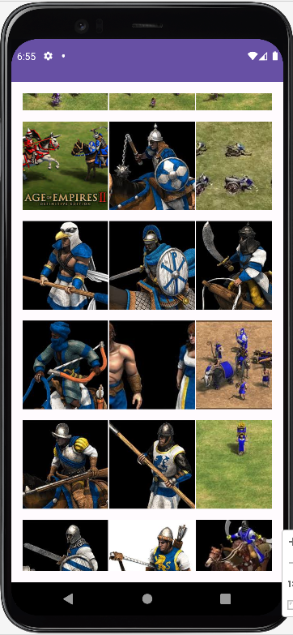
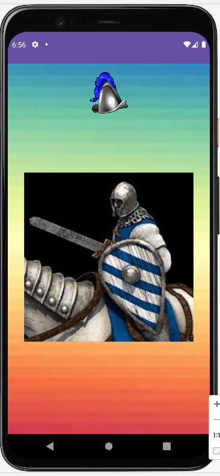

# Grid-Images-app
 Simple Android application showcasing a grid view of images with the ability to view full-size images.

## Screenshots
- Grid View

- Full Image View
  

## Features

- Grid view of images
- Ability to view full-size images
- Simple and intuitive user interface

## How to Use

1. Open the app to view the grid view of images.
2. Tap on any thumbnail to view the full-size image.
3. Use the back button or gesture to return to the grid view.

## Installation

You can install the app by following these steps:
- [Downloading the APK](app-debug.apk) directly to your Android device and installing it.
- Cloning the repository and opening it in Android Studio. Run the app on an Android device or emulator.

